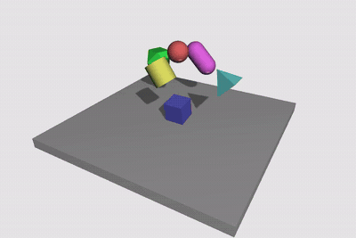
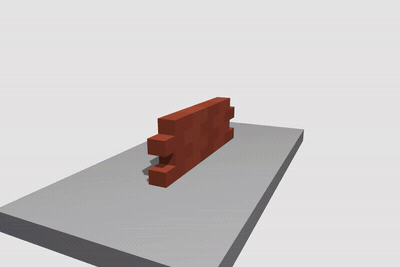
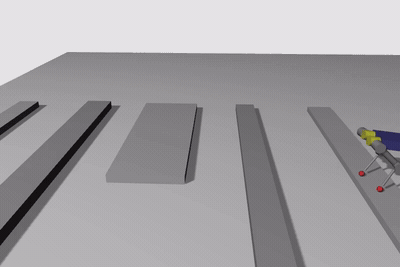
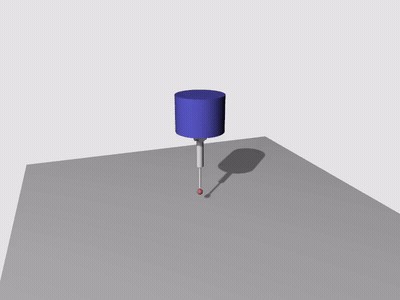
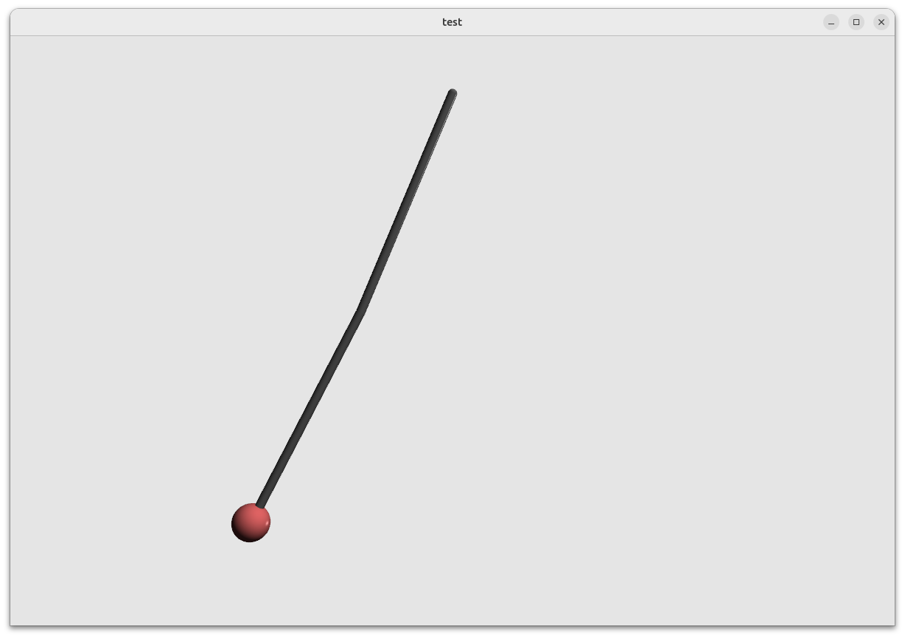

# tact

`tact` is a high contact/tactile fidelity dynamics simulator.

<p align="center">
  
  <br>
  
  
</p>

This directory contains two faces of the same simulator:

| Name | Role |
| --- | --- |
| `tact` | Core simulator identity, C library name, and Python import namespace |
| `pytact` | Python distribution package installed with `pip install pytact` |
| `libtact.so` | Native shared library used by both Python and standalone C programs |

## Python API

Install the published package:

```bash
pip install pytact
```

For editable development from this checkout, use the repository `uv`
environment instead of the system `pip`. The package requires Python 3.12 or
newer, and the root workspace at `~/fg` owns that environment:

```bash
cd ~/fg
uv pip install -e ./tact
```

The editable install calls `make package-lib` inside `tact/`. That builds the
canonical native library at `native/lib/libtact.so` and copies the same file to
the package-local `tact/bin/libtact.so`, which is what `import tact` loads.

After the editable install, Python source edits under `tact/tact/` are used on
the next run without reinstalling. After C source edits under `native/`, rebuild
the shared library:

```bash
cd ~/fg/tact
make
```

The default `make` target also refreshes `tact/bin/libtact.so`, so the Python
package and native C output stay in sync.

Verify the install:

```bash
cd ~/fg
uv run python -c "import tact; print(tact.__file__)"
```

Use:

```python
import tact

model = tact.Model("scene")
q, qd, y, ctx = model.step(model.q0, model.qd0, None)
```

The Python package owns YAML scene loading, asset resolution, high-level
simulation helpers, controllers, rendering wrappers, and packaging. It wraps the
package-local native library at `tact/bin/libtact.so`.

### Minimal 2-link manipulator



Create `minimal.yaml`:

```yaml
sim: {solver: lcp, dt: 0.002, g: [0, 0, -9.81]}
view: {target: [0, 0, -1], distance: 3, yaw: 0, pitch: 0}
lights: [{pos: [7, 7, 7], target: [0, 0, 0], ortho: 5.0, shadow: true}]

bodies:
  - name: link1
    joint: {type: rev, parent: root, euler: [0, 90, 0], damping: 0.2, q0: 45}
    inertial: {mass: 1.0, tensor: [diag, 0.004, 0.004, 0.004], pos: [0.5, 0, 0]}
    shapes: [{type: capsule, pos: [0.5, 0, 0], euler: [0, 90, 0], param: [0.02, 0.5], rgba: [0.4, 0.4, 0.4, 1.0]}]

  - name: link2
    joint: {type: rev, parent: link1, pos: [1.0, 0, 0], damping: 0.2, q0: 45}
    inertial: {mass: 1.0, tensor: [diag, 0.002, 0.002, 0.002], pos: [0.5, 0, 0]}
    shapes:
      - {type: capsule, pos: [0.5, 0, 0], euler: [0, 90, 0], param: [0.02, 0.5], rgba: [0.4, 0.4, 0.4, 1.0]}
      - {type: sphere, pos: [1.0, 0, 0], param: [0.08], rgba: [0.9, 0.4, 0.4, 1.0]}

feeds:
  - jointpos: [link1, link2]
  - jointvel: [link1, link2]
```

The simulation step can also be expressed as steps per second. For example,
`sps: 240` is equivalent to `dt: 1/240`:

```yaml
sim: {solver: lcp, sps: 240, g: [0, 0, -9.81]}
```

`sps` must be finite and greater than zero. If both `dt` and `sps` are
present, `dt` takes precedence and the loader emits a warning.

Create `minimal.py` in the same directory:

```python
import numpy as np
import tact

env = tact.Env("minimal", render=True, redraw=8)
tau = np.zeros(env.dof)
cnt = 0

while True:
    y = env.step(tau)
    if cnt % 100 == 0:
        q = y[: env.dof]
        qd = y[env.dof :]
        print(f"{cnt:04d} q={q.round(4)} qd={qd.round(4)} y={y.round(4)}")
    cnt += 1
```

Run it from the directory containing both files:

```bash
python minimal.py
```

## Source Layout

```text
native/              C engine sources and public header tact.h
native/lib/          native C shared library output from make
native/demos/basic/  minimal standalone C demo using compiled .bin models
demos/               checkout-only examples for GitHub users
tact/                Python package source
tests/               regression and packaging smoke tests
```

From a checkout, `make` builds the native C library at `native/lib/libtact.so`
and copies that same library to the package-local `tact/bin/libtact.so` used by
Python, then builds the native demo. `make package-lib` performs only the native
library build plus package-local copy, without building demos. Python packaging
uses that same `make package-lib` path, so editable installs and normal local
builds share one C build recipe.

For PyPI release artifacts, build through the manylinux container path:

```bash
make dist-pypi
```

That target creates the sdist with `uv build --sdist`, then builds the wheel with
`cibuildwheel` inside the configured manylinux image. Do not upload the local
`linux_x86_64` wheel from `uv build --wheel`; PyPI accepts the repaired
`manylinux_*_x86_64` wheel produced by `make dist-pypi`.
